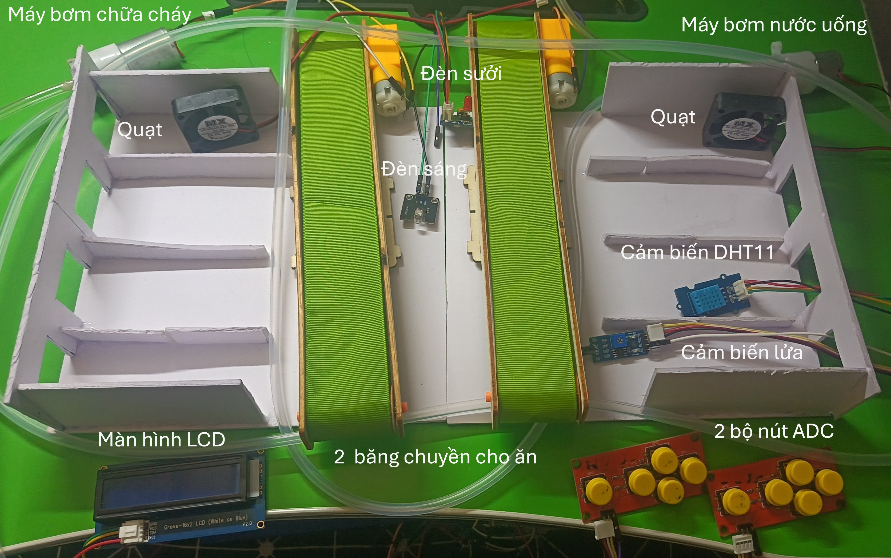
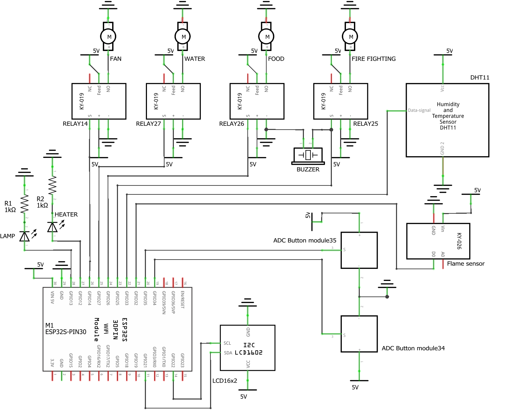

# Trang trại chăn nuôi ứng dụng IoT

Trang trại chăn nuôi là một hệ thống hỗ trợ việc quản lý và chăm sóc vật nuôi, đảm bảo vật nuôi phát triển tốt, đem lại nguồn lợi lớn cho người chăn nuôi. Hệ thống sử dụng ESP32, giao thức MQTT và Node-RED

## Tác giả

Dự án cuối kỳ do Nguyễn Viết Tuấn - MSV 22001363 thực hiện trong môn học Phát triển ứng dụng IoT, lớp K67 Kỹ thuật Điện tử và Tin học, trường Đại học Khoa học tự nhiên, Đại học Quốc gia Hà Nội.

## Tính năng

1, Bật, tắt đèn sáng bằng nút bấm hoặc web.

2, Điều chỉnh nhiệt độ

* Ở chế độ tự động, quạt và đèn sưởi tự động bật tắt theo nhiệt độ đo được với giới hạn nhiệt độ do người dùng đặt trên web.
* Ở chế độ thủ công, bật tắt quạt và đèn sưởi bằng nút bấm và web.

3, Cho vật nuôi ăn uống

* Bật tắt 2 băng chuyền cho ăn và máy bơm nước uống bằng nút bấm và web.
* Hẹn giờ cho ăn uống, gửi qua email từ web.

4, Chữa cháy

* Kiểm tra cháy bằng cảm biến lửa, nếu có cháy thì gửi email.
* Ở chế độ thủ công, có thể bật tắt máy bơm nước chữa cháy qua nút bấm và web, còi báo động cũng sẽ hoạt động cùng với máy bơm.
* Ở chế độ tự động, nếu có cháy thì máy bơm chữa cháy sẽ hoạt động cùng với còi báo động.

5, Việc điều khiển qua nút bấm sẽ hoạt động khi không có kết nối internet.

## Phần cứng

1, Module ESP32 WROOM 32 [Link](linhs://linhkienchatluong.vn/urlmodule-ethenetwifi/module-esp32-wroom-32-nodemcu-32s-30-pin_sp492_ct14957.aspx)

2, Nguồn điện

* Nguồn adapter 5V 2A [Link](https://linhkienchatluong.vn/urlnguon-adapter---nguon-vo-nhua/nguon-adapter-5v-2a_sp1965_ct2357.aspx)
* Jack nguồn DC cái 5.5x2.1mm [Link](https://linhkienchatluong.vn/urljack-nguon-dc-cai/jack-nguon-dc-cai-55x21mm-dau-day-dung-vit_sp1823_ct5911.aspx)

3, Cảm biến và điều khiển

* Cảm biến nhiệt độ và độ ẩm DHT11 [Link](https://linhkienchatluong.vn/urlnhiet-do---do-am/module-cam-bien-nhiet-do-do-am-dht11_sp1670_ct165.aspx)
* Cảm biến lửa KY-026 [Link](https://linhkienchatluong.vn/urlmodule-cam-bien/module-cam-bien-lua-2-dau-ra-so-va-tuong-tu_sp1328_ct15301.aspx)
* 2 Module 5 nút ADC [Link](https://shopee.vn/fastordervn/22381000450)

4, Cơ chấu chấp hành

* LED 10mm đỏ chân dài 29mm (10c) [Link](https://linhkienchatluong.vn/urlled-don-10mm---f10/led-10mm-do-chan-dai-29mm-10c_sp1978_ct5880.aspx)
* LED 8mm trắng chân dài 29mm (10c) [Link](https://linhkienchatluong.vn/urlled-don-8mm---f8/led-8mm-trang-sieu-sang-chan-dai-29mm-10c_sp1977_ct16594.aspx)
* 4 Module relay 1 kênh 5V [Link](https://linhkienchatluong.vn/urlmodule-relay/module-relay-1-kenh-5vdc-tuy-chon-kich-hoat-muc-cao-hoac-thap-hl_sp501_ct8508.aspx)
* 2 quạt tản nhiệt 5V [Link](https://linhkienchatluong.vn/urlquat-dc-5v--12v---24v/quat-tan-nhiet-5v-7x7x25cm_sp1110_ct8986.aspx)
* 2 máy bơm [Link](https://shopee.vn/laptrinhnhung_a_z/27441887332)
* 2 băng chuyền [Link](https://shopee.vn/laptrinhnhung_a_z/25925178711)
* Module còi KY-012 [Link](https://linhkienchatluong.vn/urlmodule-audio/active-buzzer-module-ky-012---module-coi-bao_sp505_ct5064.aspx)

5, Dây điện, điện trở, Board test MB-102

## Hình ảnh

Hình ảnh hệ thống

Sơ đồ nguyên lý

## Cách sử dụng

B1: Tải mã nguồn của dự án

Với ESP32:

B1: Dùng PlatformIO trong Visual Studio Code để tạo project mới.

B2: Copy các file từ thư mục Code\_ESP32 vào project mới.

B3: Trong thư mục include/secrets, chỉnh sửa file wifi.h và mqtt.h tương ứng.

B4: Trong thư mục src, chỉnh sửa file ca_cert_emqx.h

B5: Trong file platformio.ini, có thể sửa lại các chân kết nối.

B6: Compile và Upload vào ESP32.

Với Node-RED

B1: Mở Node-RED, import file flows.json

B2: Tải các thư viện còn thiếu (node-red-dashboard, node-red-node-email)

B3: Chỉnh sửa các node MQTT in, MQTT out, Email

B4: Deploy

## Video Demo

https://youtu.be/gljpb4TCUY8?si=1LuEsQNhKYvjf9dE

